# Problem 6: Scoreboard Module - Backend API Specification

## 1. Overview

This document provides the technical specification for a **real-time scoreboard module** that displays the top 10 user scores with live updates. The system handles score updates triggered by user actions while implementing robust security measures to prevent unauthorized score manipulation.

---

## 2. Table of Contents

1. [Overview](#1-overview)
2. [Table of Contents](#2-table-of-contents)
3. [Requirements Summary](#3-requirements-summary)
4. [System Architecture](#4-system-architecture)
5. [Execution Flow Diagrams](#5-execution-flow-diagrams)
6. [API Specifications](#6-api-specifications)
7. [Data Models](#7-data-models)
8. [Security Implementation](#8-security-implementation)
9. [Real-Time Updates](#9-real-time-updates)
10. [Implementation Notes](#10-implementation-notes)
11. [Improvements & Future Considerations](#11-improvements--future-considerations)

---

## 3. Requirements Summary

| # | Requirement | Description |
|---|-------------|-------------|
| 1 | Scoreboard Display | Show top 10 users' scores on the website |
| 2 | Live Updates | Real-time scoreboard refresh without page reload |
| 3 | Score Increment | User completes an action → score increases |
| 4 | API Integration | Action completion triggers API call to update score |
| 5 | Security | Prevent malicious/unauthorized score manipulation |

---

## 4. System Architecture

### 4.1 Component Diagram

```mermaid
graph TB
    subgraph Frontend["🖥️ FRONTEND"]
        WebApp["Web Application<br/>• Display Top 10 Scoreboard<br/>• Trigger actions<br/>• WebSocket connection"]
    end

    subgraph Backend["⚙️ BACKEND API SERVER"]
        subgraph Middleware["Middleware Layer"]
            Auth[Auth<br/>Middleware]
            RateLimit[Rate<br/>Limiter]
            Validation[Request<br/>Validation]
        end
        
        subgraph Controllers["Controller Layer"]
            ScoreCtrl[ScoreController<br/>• updateScore]
            LeaderboardCtrl[LeaderboardController<br/>• getTop10]
        end
        
        subgraph Services["Service Layer"]
            ScoreService[ScoreService<br/>• validateAction<br/>• incrementScore]
            LeaderboardService[LeaderboardService<br/>• getLeaderboard<br/>• broadcastUpdate]
        end
        
        WSManager["WebSocket Manager<br/>• Manage connections<br/>• Broadcast updates"]
    end

    subgraph DataLayer["💾 DATA LAYER"]
        DB[("PostgreSQL/MySQL<br/>• users<br/>• scores<br/>• action_logs")]
        Cache[("Redis<br/>• Leaderboard cache<br/>• Session tokens<br/>• Rate limits")]
    end

    WebApp -->|HTTP/WebSocket| Middleware
    Middleware --> Controllers
    Controllers --> Services
    Services --> WSManager
    Services --> DB
    Services --> Cache
    WSManager --> Cache

    style Frontend fill:#e1f5ff
    style Backend fill:#fff4e1
    style DataLayer fill:#f0f0f0
    style Auth fill:#90caf9
    style RateLimit fill:#90caf9
    style Validation fill:#90caf9
```



### 4.2 Technology Stack (Recommended)

| Layer | Technology | Purpose |
|-------|------------|---------|
| API Server | Node.js/Express or Go/Gin | REST API + WebSocket handling |
| Database | PostgreSQL | Persistent storage, source of truth |
| Cache | Redis | Leaderboard caching, real-time pub/sub |
| Auth | JWT | Stateless authentication |
| Real-time | WebSocket (Socket.io/ws) | Live scoreboard updates |

---

## 5. Execution Flow Diagrams

### 5.1 Flow 1: Score Update (Main Flow)

This diagram illustrates the complete flow when a user completes an action and their score is updated.


### 5.2 Flow 2: Real-Time Leaderboard Update

This diagram shows how connected clients receive live updates when the leaderboard changes.


### 5.3 Flow 3: Get Leaderboard (Initial Load)


---

## 6. API Specifications

### 6.1 Endpoints Overview

| Method | Endpoint | Description | Auth Required |
|--------|----------|-------------|---------------|
| POST | `/api/scores/update` | Update user's score after action | Yes |
| GET | `/api/leaderboard` | Get top 10 scores | No |
| WS | `/ws/leaderboard` | WebSocket for live updates | Optional |

---

### 6.2 POST `/api/scores/update`

Updates the user's score after completing an action.

**Request Headers:**
```http
Authorization: Bearer <JWT_TOKEN>
Content-Type: application/json
```

**Request Body:**
```json
{
  "action_id": "unique-action-uuid-123",
  "action_type": "COMPLETE_TASK",
  "timestamp": "2026-02-02T10:30:00Z",
  "signature": "HMAC_SHA256_signature_of_payload"
}
```

| Field | Type | Required | Description |
|-------|------|----------|-------------|
| action_id | string | Yes | Unique identifier for idempotency |
| action_type | string | Yes | Type of action completed |
| timestamp | ISO8601 | Yes | When action was completed |
| signature | string | Yes | HMAC signature for validation |

**Success Response (200):**
```json
{
  "success": true,
  "data": {
    "user_id": "user_123",
    "previous_score": 100,
    "new_score": 110,
    "score_increment": 10,
    "current_rank": 5
  }
}
```

**Error Responses:**

| Status | Code | Description |
|--------|------|-------------|
| 400 | INVALID_REQUEST | Missing or malformed parameters |
| 401 | UNAUTHORIZED | Invalid or missing JWT token |
| 403 | INVALID_SIGNATURE | Action signature validation failed |
| 409 | DUPLICATE_ACTION | Action already processed (idempotency) |
| 429 | RATE_LIMITED | Too many requests |

---

### 6.3 GET `/api/leaderboard`

Retrieves the top 10 scores.

**Query Parameters:**
| Param | Type | Default | Description |
|-------|------|---------|-------------|
| limit | int | 10 | Number of entries (max: 10) |

**Success Response (200):**
```json
{
  "success": true,
  "data": {
    "leaderboard": [
      { "rank": 1, "user_id": "user_001", "username": "Champion", "score": 5000 },
      { "rank": 2, "user_id": "user_042", "username": "ProPlayer", "score": 4800 },
      { "rank": 3, "user_id": "user_108", "username": "Legend", "score": 4500 }
    ],
    "updated_at": "2026-02-02T10:30:00Z"
  }
}
```

---

### 6.4 WebSocket `/ws/leaderboard`

Real-time connection for live leaderboard updates.

**Connection:**
```javascript
const ws = new WebSocket('wss://api.example.com/ws/leaderboard');
```

**Server Messages:**
```json
{
  "type": "LEADERBOARD_UPDATE",
  "data": {
    "leaderboard": [
      { "rank": 1, "user_id": "user_001", "username": "Champion", "score": 5010 }
    ],
    "updated_at": "2026-02-02T10:30:05Z"
  }
}
```

---

## 7. Data Models

### 7.1 Database Schema

```sql
-- Users table
CREATE TABLE users (
    id UUID PRIMARY KEY DEFAULT gen_random_uuid(),
    username VARCHAR(50) UNIQUE NOT NULL,
    email VARCHAR(255) UNIQUE NOT NULL,
    password_hash VARCHAR(255) NOT NULL,
    score INTEGER DEFAULT 0,
    created_at TIMESTAMP DEFAULT CURRENT_TIMESTAMP,
    updated_at TIMESTAMP DEFAULT CURRENT_TIMESTAMP
);

-- Index for leaderboard queries (critical for performance)
CREATE INDEX idx_users_score_desc ON users(score DESC);

-- Action logs for idempotency and audit
CREATE TABLE action_logs (
    id UUID PRIMARY KEY DEFAULT gen_random_uuid(),
    user_id UUID REFERENCES users(id),
    action_id VARCHAR(255) UNIQUE NOT NULL,  -- For idempotency
    action_type VARCHAR(50) NOT NULL,
    score_awarded INTEGER NOT NULL,
    ip_address INET,
    created_at TIMESTAMP DEFAULT CURRENT_TIMESTAMP
);

-- Index for idempotency check
CREATE INDEX idx_action_logs_action_id ON action_logs(action_id);
```

### 7.2 Redis Data Structures

```
# Leaderboard sorted set (Top 10 cache)
ZADD leaderboard:top10 <score> <user_id>

# Get top 10
ZREVRANGE leaderboard:top10 0 9 WITHSCORES

# Rate limiting
INCR rate_limit:<user_id>
EXPIRE rate_limit:<user_id> 60
```

---

## 8. Security Implementation

### 8.1 Security Layers

This section is **critical** to prevent malicious users from increasing scores without authorization.

```
┌─────────────────────────────────────────────────────────────────────────────┐
│                        SECURITY ARCHITECTURE                                 │
├─────────────────────────────────────────────────────────────────────────────┤
│                                                                              │
│  LAYER 1: Authentication (JWT)                                              │
│  ─────────────────────────────                                              │
│  • All score update requests MUST include valid JWT                         │
│  • JWT contains: user_id, issued_at, expires_at                             │
│  • Token expiration: 1 hour (refresh token for extended sessions)           │
│                                                                              │
│  LAYER 2: Action Signature Validation                                       │
│  ─────────────────────────────────────                                      │
│  • Server generates a secret key per user session                           │
│  • Client must sign action payload with this key                            │
│  • Server verifies signature before processing                              │
│                                                                              │
│  Signature = HMAC_SHA256(action_id + action_type + timestamp, secret_key)   │
│                                                                              │
│  LAYER 3: Idempotency                                                       │
│  ────────────────────                                                       │
│  • Each action has a unique action_id                                       │
│  • Duplicate action_id → 409 Conflict (prevents replay attacks)             │
│  • Store processed action_ids in database                                   │
│                                                                              │
│  LAYER 4: Rate Limiting                                                     │
│  ──────────────────────                                                     │
│  • Max 10 score updates per minute per user                                 │
│  • Max 100 requests per minute per IP                                       │
│  • Exceeding limits → 429 Too Many Requests                                 │
│                                                                              │
│  LAYER 5: Server-Side Validation                                            │
│  ────────────────────────────────                                           │
│  • Score increment values are determined server-side                        │
│  • Client cannot specify score amount                                       │
│  • Action type → predefined score mapping on server                         │
│                                                                              │
└─────────────────────────────────────────────────────────────────────────────┘
```

### 8.2 Action Validation Flow

```
┌──────────────────────────────────────────────────────────────────────────┐
│                     ACTION VALIDATION PROCESS                             │
├──────────────────────────────────────────────────────────────────────────┤
│                                                                           │
│  Step 1: Client receives action_secret_key on login                       │
│          (stored securely, never exposed)                                 │
│                                                                           │
│  Step 2: When action completes, client creates signed payload:            │
│                                                                           │
│     payload = {                                                           │
│       action_id: "uuid-v4",                                               │
│       action_type: "COMPLETE_TASK",                                       │
│       timestamp: "2026-02-02T10:30:00Z"                                   │
│     }                                                                     │
│                                                                           │
│     signature = HMAC_SHA256(                                              │
│       action_id + action_type + timestamp,                                │
│       action_secret_key                                                   │
│     )                                                                     │
│                                                                           │
│  Step 3: Server validates:                                                │
│     ✓ JWT is valid and not expired                                        │
│     ✓ Signature matches (recalculated server-side)                        │
│     ✓ Timestamp is within acceptable range (±5 minutes)                   │
│     ✓ action_id has not been used before                                  │
│                                                                           │
│  Step 4: If all checks pass → increment score                             │
│          If any check fails → reject request                              │
│                                                                           │
└──────────────────────────────────────────────────────────────────────────┘
```

### 8.3 Rate Limiting Configuration

| Limit Type | Value | Window | Action on Exceed |
|------------|-------|--------|------------------|
| Per User (score updates) | 10 requests | 1 minute | 429 + retry-after header |
| Per IP (all endpoints) | 100 requests | 1 minute | 429 + temporary block |
| WebSocket connections | 3 per user | - | Close oldest connection |

---

## 9. Real-Time Updates

### 9.1 WebSocket Implementation

```javascript
// Server-side pseudocode
class LeaderboardWebSocketManager {
  constructor(redisClient) {
    this.connections = new Map();  // userId -> WebSocket
    this.redisClient = redisClient;
    
    // Subscribe to leaderboard updates channel
    redisClient.subscribe('leaderboard:updates', (message) => {
      this.broadcastToAll(JSON.parse(message));
    });
  }
  
  handleConnection(ws, userId) {
    this.connections.set(userId, ws);
    
    // Send current leaderboard on connect
    this.sendCurrentLeaderboard(ws);
    
    ws.on('close', () => {
      this.connections.delete(userId);
    });
  }
  
  broadcastToAll(leaderboardData) {
    const message = JSON.stringify({
      type: 'LEADERBOARD_UPDATE',
      data: leaderboardData
    });
    
    this.connections.forEach((ws) => {
      if (ws.readyState === WebSocket.OPEN) {
        ws.send(message);
      }
    });
  }
}
```

### 9.2 When to Broadcast Updates

Only broadcast when the **top 10 actually changes**:

```javascript
async function updateScoreAndBroadcast(userId, newScore) {
  // 1. Update score in database
  await db.updateUserScore(userId, newScore);
  
  // 2. Check if this affects top 10
  const previousTop10 = await cache.get('leaderboard:top10');
  const newTop10 = await db.getTop10();
  
  // 3. Only broadcast if top 10 changed
  if (hasTop10Changed(previousTop10, newTop10)) {
    await cache.set('leaderboard:top10', newTop10);
    await redis.publish('leaderboard:updates', JSON.stringify(newTop10));
  }
}
```

---

## 10. Implementation Notes

### 10.1 Performance Considerations

| Aspect | Recommendation |
|--------|----------------|
| Leaderboard Query | Use Redis sorted set for O(log N) operations |
| Cache TTL | Top 10 cache: 5-10 seconds (balance freshness vs DB load) |
| Database Index | Ensure `idx_users_score_desc` index exists |
| WebSocket | Use heartbeat (30s) to detect stale connections |

### 10.2 Error Handling

- Return meaningful error codes and messages
- Log all failed validation attempts for security monitoring
- Implement circuit breaker for database failures

### 10.3 Testing Requirements

| Test Type | Scope |
|-----------|-------|
| Unit Tests | Signature validation, score calculation |
| Integration Tests | API endpoints, database operations |
| Load Tests | Concurrent score updates, WebSocket connections |
| Security Tests | JWT validation, replay attack prevention |

---

## 11. Assumptions & Trade-offs Analysis

### 11.1 Core Assumptions

This design is based on the following assumptions about system requirements and usage patterns:

| # | Assumption | Impact | Mitigation if Invalid |
|---|------------|--------|----------------------|
| 1 | **User base: ~100K active users** | Determines scaling needs for DB/Cache | If larger: Need sharding, read replicas, CDN |
| 2 | **Peak: ~10K concurrent score updates/min** | Influences rate limiting and DB write capacity | Implement write buffering, queue system |
| 3 | **Top 10 changes ~1-10 times/minute** | Affects broadcast frequency | Implement smart diffing, batch updates |
| 4 | **Score range: 0-1,000,000** | Determines data types (INTEGER vs BIGINT) | Use BIGINT if scores can exceed 2B |
| 5 | **Actions are client-verifiable** | Enables signature-based security | If not: Need full server-side game state verification |
| 6 | **Network latency: <100ms acceptable** | WebSocket polling vs real-time push | If critical: Consider edge computing, regional servers |
| 7 | **Score accuracy > speed** | Prioritizes consistency over availability | If reversed: Use eventual consistency, CRDT |
| 8 | **Budget: mid-tier infrastructure** | Single-region deployment, modest Redis cluster | If unlimited: Multi-region, extensive caching |

---

### 11.2 Critical Trade-off Decisions

#### Trade-off 1: **Consistency vs Availability (CAP Theorem)**

**Options Considered:**

| Approach | Pros | Cons | When to Use |
|----------|------|------|-------------|
| **Strong Consistency** (Chosen) | • Accurate scores<br/>• Prevents race conditions<br/>• Trustworthy leaderboard | • Higher latency (~50-200ms)<br/>• Single point of failure<br/>• Lower throughput | **Financial apps, competitive gaming**<br/>Where accuracy is critical |
| Eventual Consistency | • Lower latency (~10-50ms)<br/>• Higher availability<br/>• Better scalability | • Temporary inconsistencies<br/>• Complex conflict resolution<br/>• User confusion | Social apps, casual games<br/>Where approximate data is OK |

**Decision:** Use **Strong Consistency** with PostgreSQL transactions + Redis cache invalidation
**Rationale:** Scoreboard credibility depends on accuracy. Users must trust rankings.

**Implementation:**
```sql
BEGIN TRANSACTION ISOLATION LEVEL SERIALIZABLE;
  -- Update score
  UPDATE users SET score = score + 10 WHERE id = $1;
  -- Log action
  INSERT INTO action_logs (...) VALUES (...);
COMMIT;
```

---

#### Trade-off 2: **WebSocket vs Server-Sent Events (SSE) vs Polling**

**Options Compared:**

| Technology | Latency | Browser Support | Complexity | Firewall Issues | Reconnection |
|------------|---------|-----------------|------------|-----------------|--------------|
| **WebSocket** (Chosen) | 10-50ms | 97%+ | High | Some | Manual |
| SSE | 50-100ms | 95%+ (no IE) | Low | Rare | Automatic |
| Long Polling | 100-500ms | 100% | Medium | None | Simple |
| Short Polling | 1-5 sec | 100% | Lowest | None | N/A |

**Decision:** Use **WebSocket** with SSE fallback
**Rationale:** Real-time updates (<100ms) are important for engagement. Complexity is manageable with Socket.io library.

**Edge Case Handling:**
```javascript
// Fallback chain
if (supportsWebSocket && !behindCorporateFirewall) {
  connection = new WebSocket(url);
} else if (supportsSSE) {
  connection = new EventSource(url);
} else {
  // Polling fallback (3-second interval)
  setInterval(fetchLeaderboard, 3000);
}
```

---

#### Trade-off 3: **Cache Strategy: Write-Through vs Write-Behind vs Cache-Aside**

| Strategy | Consistency | Performance | Complexity | Data Loss Risk |
|----------|-------------|-------------|------------|----------------|
| **Write-Through** (Chosen) | Strong | Moderate | Low | None |
| Write-Behind | Eventual | High | High | Yes (if cache fails) |
| Cache-Aside | Eventual | High | Medium | None |

**Decision:** **Write-Through** with TTL-based invalidation
**Implementation:**
```javascript
async function updateScore(userId, increment) {
  // 1. Update DB first (source of truth)
  const newScore = await db.updateUserScore(userId, increment);
  
  // 2. Immediately update cache
  await redis.zadd('leaderboard:top10', newScore, userId);
  
  // 3. Set TTL to handle inconsistencies
  await redis.expire('leaderboard:top10', 10); // 10 seconds
  
  return newScore;
}
```

**Why not Write-Behind?**
- Risk: If Redis crashes before persistence, score updates are lost
- Not acceptable for a system where scores represent user achievements

---

#### Trade-off 4: **Rate Limiting: Fixed Window vs Sliding Window vs Token Bucket**

| Algorithm | Accuracy | Memory | Complexity | Burst Handling |
|-----------|----------|--------|------------|----------------|
| Fixed Window | Low | O(1) | Low | Poor (burst at boundaries) |
| **Sliding Window** (Chosen) | High | O(N) | Medium | Good |
| Token Bucket | High | O(1) | High | Excellent |

**Decision:** **Sliding Window** via Redis
**Implementation:**
```javascript
async function checkRateLimit(userId) {
  const key = `rate:${userId}`;
  const now = Date.now();
  const window = 60000; // 1 minute
  
  // Add current request timestamp
  await redis.zadd(key, now, `${now}-${Math.random()}`);
  
  // Remove old entries outside window
  await redis.zremrangebyscore(key, 0, now - window);
  
  // Count requests in window
  const count = await redis.zcard(key);
  
  // Set expiry
  await redis.expire(key, 60);
  
  return count <= 10; // Max 10 per minute
}
```

**Why not Token Bucket?**
- More complex implementation
- Sliding window provides sufficient accuracy for our use case
- Easier to explain to other developers

---

#### Trade-off 5: **Security: Action Signatures vs Server-Side Game Logic**

| Approach | Security Level | Client Complexity | Server Load | Cheating Risk |
|----------|----------------|-------------------|-------------|---------------|
| Action Signatures (Chosen) | Medium | High | Low | Medium |
| **Full Server Verification** | High | Low | Very High | Low |
| Client-Side Only | None | Low | Lowest | Critical |

**Decision:** **Hybrid Approach** - Signatures + Spot Verification
**Rationale:** Balance between security and performance

**Implementation:**
```javascript
// Layer 1: Always verify signatures (cheap)
const isValidSignature = verifyHMAC(payload, signature, userSecret);

// Layer 2: Randomly verify 10% of actions server-side (expensive)
if (Math.random() < 0.1 || user.suspiciousActivityFlag) {
  const serverResult = await gameEngine.verifyAction(
    userId, 
    actionType, 
    gameState
  );
  
  if (!serverResult.valid) {
    flagUser(userId, 'INVALID_ACTION');
    throw new SecurityError('Action verification failed');
  }
}
```

**Cost-Benefit Analysis:**
- Full verification: $$$$ infrastructure cost for 100K users
- Signature only: $ cost but ~5% cheating rate acceptable?
- **Hybrid: $$ cost with <1% cheating rate** ✅

---

#### Trade-off 6: **Database: SQL vs NoSQL**

| Database | Consistency | Transactions | Scalability | Query Flexibility |
|----------|-------------|--------------|-------------|-------------------|
| **PostgreSQL** (Chosen) | ACID | Yes | Vertical + Sharding | SQL (powerful) |
| MongoDB | Eventual | Limited | Horizontal | NoSQL (flexible) |
| DynamoDB | Eventual | Conditional | Massive | Key-value (limited) |

**Decision:** **PostgreSQL**
**Rationale:**
1. **ACID transactions** required for score accuracy
2. **Complex queries** needed (leaderboard with filters, user rank calculation)
3. **Proven reliability** for financial-critical data
4. Easy migration path to read replicas if scaling needed

**When to reconsider:**
- If write load exceeds 10K TPS per server → Consider sharding or Cassandra
- If need multi-region active-active → Consider CockroachDB

---

### 11.3 Scalability Decision Tree

```
                        Current System Load?
                               │
                 ┌─────────────┴─────────────┐
                 │                           │
         < 1K concurrent users        > 10K concurrent users
                 │                           │
         Current architecture          Need optimization
         is sufficient                       │
                                    ┌────────┴────────┐
                                    │                 │
                             Read-heavy         Write-heavy
                                    │                 │
                            ┌───────┴────┐         ┌──┴────┐
                            │            │         │       │
                    Add read replicas  CDN    Sharding  Queue
                    Redis cluster      cache   DB       system
```

**Scaling Thresholds:**

| Metric | Threshold | Action Required |
|--------|-----------|-----------------|
| API latency p95 | > 500ms | Add caching, optimize queries |
| DB CPU | > 70% | Add read replica or vertical scale |
| Redis memory | > 80% | Implement LRU eviction, add cluster nodes |
| WebSocket connections | > 50K | Add WebSocket gateway (like Pusher) |
| Score updates/sec | > 100 TPS | Implement write queue (Kafka/RabbitMQ) |

---

### 11.4 Cost Analysis

**Estimated Infrastructure Costs (Monthly):**

| Scenario | Users | Infrastructure | Cost (USD) | Notes |
|----------|-------|----------------|------------|-------|
| **MVP** | 1K | • 1x API server (2 vCPU)<br/>• 1x PostgreSQL (2 vCPU)<br/>• 1x Redis (1GB) | ~$50 | AWS Lightsail / DigitalOcean |
| **Production** (Chosen) | 50K | • 2x API servers (4 vCPU)<br/>• 1x PostgreSQL (8 vCPU)<br/>• 1x Redis cluster (5GB) | ~$300 | AWS EC2 / RDS |
| **High Scale** | 500K | • Auto-scaling (4-10 servers)<br/>• PostgreSQL + 2 read replicas<br/>• Redis cluster (20GB)<br/>• Kafka (3 brokers) | ~$1,500 | Full AWS stack |

**Cost Optimization Strategies:**
1. Use CDN for static leaderboard snapshots (reduces API calls by 70%)
2. Implement aggressive caching (TTL: 5-10 seconds)
3. Use spot instances for non-critical worker processes
4. Compress WebSocket messages (saves ~40% bandwidth)

---

### 11.5 Known Limitations & Mitigations

| Limitation | Impact | Mitigation Strategy |
|------------|--------|---------------------|
| **Single DB write bottleneck** | Max ~5K writes/sec | Implement write buffering, batch inserts |
| **WebSocket connection limits** | ~10K per server | Use dedicated WebSocket gateway service |
| **Cache invalidation complexity** | Stale data for <10 seconds | Acceptable for non-financial app; document TTL |
| **Timezone issues** | Inconsistent timestamps | Always use UTC, convert on client |
| **Network partitions** | Temporary unavailability | Implement circuit breaker, graceful degradation |

---

## 12. Improvements & Future Considerations

### 12.1 Scalability Enhancements

For high-traffic scenarios, consider:

| Improvement | Benefit | Implementation Effort | Priority |
|-------------|---------|----------------------|----------|
| **Redis Cluster** | Horizontal scaling for caching layer | Medium | High |
| **Database Read Replicas** | Offload leaderboard reads | Low | High |
| **Message Queue (Kafka/RabbitMQ)** | Decouple score updates from real-time broadcasts | High | Medium |
| **CDN for Static Assets** | Reduce server load | Low | Medium |
| **GraphQL API** | Flexible queries, reduce over-fetching | Medium | Low |

### 12.2 Security Enhancements

| Enhancement | Description | Risk Reduction |
|-------------|-------------|----------------|
| **Server-Side Action Verification** | For critical actions, verify completion on server (e.g., game logic) | 95% |
| **Anomaly Detection** | Flag users with unusual score patterns (ML-based) | 80% |
| **Device Fingerprinting** | Detect multi-account abuse | 60% |
| **CAPTCHA Integration** | Add for suspicious activity patterns | 70% |
| **Blockchain Audit Trail** | Immutable log of score changes (extreme trust requirement) | 99% |

### 12.3 Feature Additions

| Feature | Description | User Impact |
|---------|-------------|-------------|
| **Time-based Leaderboards** | Daily, weekly, monthly rankings | High engagement |
| **User Rank API** | Endpoint to get specific user's rank | Better UX |
| **Score History** | Track score progression over time | Gamification |
| **Push Notifications** | Notify users of rank changes | Retention |
| **Social Features** | Friend leaderboards, challenges | Viral growth |

### 12.4 Monitoring & Observability

```
Recommended Metrics:
├── API Response Times (p50, p95, p99)
├── Score Update Success/Failure Rate
├── WebSocket Connection Count
├── Cache Hit/Miss Ratio
├── Rate Limit Trigger Count
├── Suspicious Activity Alerts
├── Database Query Performance
├── Redis Memory Usage
└── Cost per Transaction
```

**Alerting Thresholds:**
- API latency p99 > 1 second → Page on-call engineer
- Error rate > 1% → Investigate immediately
- Suspicious activity > 10 events/hour → Security review

---

## 13. Alternative Architecture: Event-Driven Approach

For comparison, here's an alternative architecture using event sourcing:

```
┌─────────────┐      ┌──────────────┐      ┌─────────────┐
│   Client    │─────>│  API Gateway │─────>│   Kafka     │
└─────────────┘      └──────────────┘      └──────┬──────┘
                                                    │
                          ┌─────────────────────────┼────────────┐
                          │                         │            │
                    ┌─────▼─────┐          ┌────────▼────────┐   │
                    │  Score    │          │  Leaderboard    │   │
                    │ Processor │          │   Aggregator    │   │
                    └─────┬─────┘          └────────┬────────┘   │
                          │                         │            │
                    ┌─────▼─────┐          ┌────────▼────────┐   │
                    │ Event Store│          │  Read Model     │   │
                    │ (Postgres) │          │   (Redis)       │   │
                    └───────────┘          └─────────────────┘   │
                                                                 │
                                            ┌────────────────────▼──┐
                                            │  WebSocket Broadcaster│
                                            └───────────────────────┘
```

**Comparison:**

| Aspect | Current (REST + Cache) | Event-Driven |
|--------|------------------------|--------------|
| Complexity | ★★☆☆☆ | ★★★★☆ |
| Scalability | ★★★☆☆ | ★★★★★ |
| Auditability | ★★★☆☆ | ★★★★★ |
| Cost | $ | $$$ |
| Time to Market | 2 weeks | 6 weeks |

**Verdict:** Current architecture is better for MVP and medium scale. Event-driven justified only for >1M users.

---

## 14. Summary & Recommendations

### 14.1 What This Specification Provides

| Aspect | Solution | Confidence Level |
|--------|----------|------------------|
| **Live Updates** | WebSocket + Redis Pub/Sub | ★★★★★ Production-ready |
| **Security** | Multi-layer (JWT + HMAC + Idempotency + Rate Limit) | ★★★★☆ Good for most apps |
| **Performance** | Redis caching + DB indexing | ★★★★☆ Supports 50K users |
| **Scalability** | Stateless design, horizontal scaling ready | ★★★☆☆ Needs work for 500K+ |

### 14.2 Implementation Priority

**Phase 1: MVP (Week 1-2)**
- [ ] Basic API endpoints (POST score, GET leaderboard)
- [ ] PostgreSQL setup with schemas
- [ ] JWT authentication
- [ ] Basic Redis caching

**Phase 2: Production (Week 3-4)**
- [ ] WebSocket implementation
- [ ] HMAC signature validation
- [ ] Rate limiting
- [ ] Idempotency checks

**Phase 3: Optimization (Week 5-6)**
- [ ] Performance monitoring
- [ ] Load testing
- [ ] Security audit
- [ ] Documentation

**Phase 4: Scale (Future)**
- [ ] Read replicas
- [ ] Redis cluster
- [ ] CDN integration
- [ ] Advanced analytics

### 14.3 Success Metrics

| Metric | Target | Measurement Method |
|--------|--------|-------------------|
| API Latency (p99) | < 500ms | Datadog / New Relic |
| WebSocket Latency | < 100ms | Custom monitoring |
| Uptime | > 99.9% | PagerDuty |
| Security Incidents | 0 critical | Manual audit |
| Cache Hit Rate | > 90% | Redis INFO stats |

### 14.4 Final Recommendations

**DO:**
1. ✅ Start with PostgreSQL (not NoSQL) for data integrity
2. ✅ Implement all 5 security layers from day 1
3. ✅ Use Redis for caching and pub/sub
4. ✅ Monitor everything (metrics, logs, traces)
5. ✅ Write comprehensive tests (unit, integration, load)

**DON'T:**
1. ❌ Skip idempotency checks (will cause duplicate scores)
2. ❌ Trust client-side score calculations
3. ❌ Over-engineer for scale you don't have yet
4. ❌ Expose database directly to frontend
5. ❌ Forget to set cache TTLs (will cause stale data)

### 14.5 Questions for Product Team

Before implementation, clarify:

1. **Score Mechanism:** What actions give points? How many?
2. **Leaderboard Scope:** Global? Regional? Friend-based?
3. **Data Retention:** How long to keep action logs? (GDPR)
4. **Budget:** Monthly infrastructure spend limit?
5. **Timeline:** Hard deadline or iterative release?
6. **Scale:** Expected user growth in 6/12 months?

---

## Document Information

| Field | Value |
|-------|-------|
| Version | 2.0.0 (Enhanced with Trade-offs Analysis) |
| Created | 2026-02-02 |
| Updated | 2026-02-03 |
| Author | Be Tuan Minh |
| Status | ✅ Ready for Implementation |
| Estimated LOC | ~3,000 lines (backend) |
| Estimated Time | 4-6 weeks (2 developers) |

---

## Appendix A: Code Structure

```
backend/
├── src/
│   ├── api/
│   │   ├── routes/
│   │   │   ├── leaderboard.routes.ts
│   │   │   └── score.routes.ts
│   │   ├── controllers/
│   │   │   ├── leaderboard.controller.ts
│   │   │   └── score.controller.ts
│   │   └── validators/
│   │       └── score.validator.ts
│   ├── services/
│   │   ├── score.service.ts
│   │   ├── leaderboard.service.ts
│   │   └── security.service.ts
│   ├── middleware/
│   │   ├── auth.middleware.ts
│   │   ├── rateLimit.middleware.ts
│   │   └── error.middleware.ts
│   ├── database/
│   │   ├── connection.ts
│   │   ├── migrations/
│   │   └── seeds/
│   ├── cache/
│   │   └── redis.client.ts
│   ├── websocket/
│   │   └── leaderboard.ws.ts
│   └── utils/
│       ├── crypto.utils.ts
│       └── logger.utils.ts
├── tests/
│   ├── unit/
│   ├── integration/
│   └── load/
├── .env.example
├── docker-compose.yml
├── package.json
└── README.md
```

---

**END OF SPECIFICATION**
