# Problem 6: Scoreboard Module - Backend API Specification

## 1. Overview

This document provides the technical specification for a **real-time scoreboard module** that displays the top 10 user scores with live updates. The system handles score updates triggered by user actions while implementing robust security measures to prevent unauthorized score manipulation.

---

## 2. Table of Contents

1. [Overview](#1-overview)
2. [Table of Contents](#2-table-of-contents)
3. [Requirements Summary](#3-requirements-summary)
4. [System Architecture](#4-system-architecture)
5. [Execution Flow Diagrams](#5-execution-flow-diagrams)
6. [API Specifications](#6-api-specifications)
7. [Data Models](#7-data-models)
8. [Security Implementation](#8-security-implementation)
9. [Real-Time Updates](#9-real-time-updates)
10. [Implementation Notes](#10-implementation-notes)
11. [Improvements & Future Considerations](#11-improvements--future-considerations)

---

## 3. Requirements Summary

| # | Requirement | Description |
|---|-------------|-------------|
| 1 | Scoreboard Display | Show top 10 users' scores on the website |
| 2 | Live Updates | Real-time scoreboard refresh without page reload |
| 3 | Score Increment | User completes an action → score increases |
| 4 | API Integration | Action completion triggers API call to update score |
| 5 | Security | Prevent malicious/unauthorized score manipulation |

---

## 4. System Architecture

### 4.1 Component Diagram

```mermaid
graph TB
    subgraph Frontend["🖥️ FRONTEND"]
        WebApp["Web Application<br/>• Display Top 10 Scoreboard<br/>• Trigger actions<br/>• WebSocket connection"]
    end

    subgraph Backend["⚙️ BACKEND API SERVER"]
        subgraph Middleware["Middleware Layer"]
            Auth[Auth<br/>Middleware]
            RateLimit[Rate<br/>Limiter]
            Validation[Request<br/>Validation]
        end
        
        subgraph Controllers["Controller Layer"]
            ScoreCtrl[ScoreController<br/>• updateScore]
            LeaderboardCtrl[LeaderboardController<br/>• getTop10]
        end
        
        subgraph Services["Service Layer"]
            ScoreService[ScoreService<br/>• validateAction<br/>• incrementScore]
            LeaderboardService[LeaderboardService<br/>• getLeaderboard<br/>• broadcastUpdate]
        end
        
        WSManager["WebSocket Manager<br/>• Manage connections<br/>• Broadcast updates"]
    end

    subgraph DataLayer["💾 DATA LAYER"]
        DB[("PostgreSQL/MySQL<br/>• users<br/>• scores<br/>• action_logs")]
        Cache[("Redis<br/>• Leaderboard cache<br/>• Session tokens<br/>• Rate limits")]
    end

    WebApp -->|HTTP/WebSocket| Middleware
    Middleware --> Controllers
    Controllers --> Services
    Services --> WSManager
    Services --> DB
    Services --> Cache
    WSManager --> Cache

    style Frontend fill:#e1f5ff
    style Backend fill:#fff4e1
    style DataLayer fill:#f0f0f0
    style Auth fill:#90caf9
    style RateLimit fill:#90caf9
    style Validation fill:#90caf9
```



### 4.2 Technology Stack (Recommended)

| Layer | Technology | Purpose |
|-------|------------|---------|
| API Server | Node.js/Express or Go/Gin | REST API + WebSocket handling |
| Database | PostgreSQL | Persistent storage, source of truth |
| Cache | Redis | Leaderboard caching, real-time pub/sub |
| Auth | JWT | Stateless authentication |
| Real-time | WebSocket (Socket.io/ws) | Live scoreboard updates |

---

## 5. Execution Flow Diagrams

### 5.1 Flow 1: Score Update (Main Flow)

This diagram illustrates the complete flow when a user completes an action and their score is updated.


### 5.2 Flow 2: Real-Time Leaderboard Update

This diagram shows how connected clients receive live updates when the leaderboard changes.


### 5.3 Flow 3: Get Leaderboard (Initial Load)


---

## 6. API Specifications

### 6.1 Endpoints Overview

| Method | Endpoint | Description | Auth Required |
|--------|----------|-------------|---------------|
| POST | `/api/scores/update` | Update user's score after action | Yes |
| GET | `/api/leaderboard` | Get top 10 scores | No |
| WS | `/ws/leaderboard` | WebSocket for live updates | Optional |

---

### 6.2 POST `/api/scores/update`

Updates the user's score after completing an action.

**Request Headers:**
```http
Authorization: Bearer <JWT_TOKEN>
Content-Type: application/json
```

**Request Body:**
```json
{
  "action_id": "unique-action-uuid-123",
  "action_type": "COMPLETE_TASK",
  "timestamp": "2026-02-02T10:30:00Z",
  "signature": "HMAC_SHA256_signature_of_payload"
}
```

| Field | Type | Required | Description |
|-------|------|----------|-------------|
| action_id | string | Yes | Unique identifier for idempotency |
| action_type | string | Yes | Type of action completed |
| timestamp | ISO8601 | Yes | When action was completed |
| signature | string | Yes | HMAC signature for validation |

**Success Response (200):**
```json
{
  "success": true,
  "data": {
    "user_id": "user_123",
    "previous_score": 100,
    "new_score": 110,
    "score_increment": 10,
    "current_rank": 5
  }
}
```

**Error Responses:**

| Status | Code | Description |
|--------|------|-------------|
| 400 | INVALID_REQUEST | Missing or malformed parameters |
| 401 | UNAUTHORIZED | Invalid or missing JWT token |
| 403 | INVALID_SIGNATURE | Action signature validation failed |
| 409 | DUPLICATE_ACTION | Action already processed (idempotency) |
| 429 | RATE_LIMITED | Too many requests |

---

### 6.3 GET `/api/leaderboard`

Retrieves the top 10 scores.

**Query Parameters:**
| Param | Type | Default | Description |
|-------|------|---------|-------------|
| limit | int | 10 | Number of entries (max: 10) |

**Success Response (200):**
```json
{
  "success": true,
  "data": {
    "leaderboard": [
      { "rank": 1, "user_id": "user_001", "username": "Champion", "score": 5000 },
      { "rank": 2, "user_id": "user_042", "username": "ProPlayer", "score": 4800 },
      { "rank": 3, "user_id": "user_108", "username": "Legend", "score": 4500 }
    ],
    "updated_at": "2026-02-02T10:30:00Z"
  }
}
```

---

### 6.4 WebSocket `/ws/leaderboard`

Real-time connection for live leaderboard updates.

**Connection:**
```javascript
const ws = new WebSocket('wss://api.example.com/ws/leaderboard');
```

**Server Messages:**
```json
{
  "type": "LEADERBOARD_UPDATE",
  "data": {
    "leaderboard": [
      { "rank": 1, "user_id": "user_001", "username": "Champion", "score": 5010 }
    ],
    "updated_at": "2026-02-02T10:30:05Z"
  }
}
```

---

## 7. Data Models

### 7.1 Database Schema

```sql
-- Users table
CREATE TABLE users (
    id UUID PRIMARY KEY DEFAULT gen_random_uuid(),
    username VARCHAR(50) UNIQUE NOT NULL,
    email VARCHAR(255) UNIQUE NOT NULL,
    password_hash VARCHAR(255) NOT NULL,
    score INTEGER DEFAULT 0,
    created_at TIMESTAMP DEFAULT CURRENT_TIMESTAMP,
    updated_at TIMESTAMP DEFAULT CURRENT_TIMESTAMP
);

-- Index for leaderboard queries (critical for performance)
CREATE INDEX idx_users_score_desc ON users(score DESC);

-- Action logs for idempotency and audit
CREATE TABLE action_logs (
    id UUID PRIMARY KEY DEFAULT gen_random_uuid(),
    user_id UUID REFERENCES users(id),
    action_id VARCHAR(255) UNIQUE NOT NULL,  -- For idempotency
    action_type VARCHAR(50) NOT NULL,
    score_awarded INTEGER NOT NULL,
    ip_address INET,
    created_at TIMESTAMP DEFAULT CURRENT_TIMESTAMP
);

-- Index for idempotency check
CREATE INDEX idx_action_logs_action_id ON action_logs(action_id);
```

### 7.2 Redis Data Structures

```
# Leaderboard sorted set (Top 10 cache)
ZADD leaderboard:top10 <score> <user_id>

# Get top 10
ZREVRANGE leaderboard:top10 0 9 WITHSCORES

# Rate limiting
INCR rate_limit:<user_id>
EXPIRE rate_limit:<user_id> 60
```

---

## 8. Security Implementation

### 8.1 Security Layers

This section is **critical** to prevent malicious users from increasing scores without authorization.

```
┌─────────────────────────────────────────────────────────────────────────────┐
│                        SECURITY ARCHITECTURE                                 │
├─────────────────────────────────────────────────────────────────────────────┤
│                                                                              │
│  LAYER 1: Authentication (JWT)                                              │
│  ─────────────────────────────                                              │
│  • All score update requests MUST include valid JWT                         │
│  • JWT contains: user_id, issued_at, expires_at                             │
│  • Token expiration: 1 hour (refresh token for extended sessions)           │
│                                                                              │
│  LAYER 2: Action Signature Validation                                       │
│  ─────────────────────────────────────                                      │
│  • Server generates a secret key per user session                           │
│  • Client must sign action payload with this key                            │
│  • Server verifies signature before processing                              │
│                                                                              │
│  Signature = HMAC_SHA256(action_id + action_type + timestamp, secret_key)   │
│                                                                              │
│  LAYER 3: Idempotency                                                       │
│  ────────────────────                                                       │
│  • Each action has a unique action_id                                       │
│  • Duplicate action_id → 409 Conflict (prevents replay attacks)             │
│  • Store processed action_ids in database                                   │
│                                                                              │
│  LAYER 4: Rate Limiting                                                     │
│  ──────────────────────                                                     │
│  • Max 10 score updates per minute per user                                 │
│  • Max 100 requests per minute per IP                                       │
│  • Exceeding limits → 429 Too Many Requests                                 │
│                                                                              │
│  LAYER 5: Server-Side Validation                                            │
│  ────────────────────────────────                                           │
│  • Score increment values are determined server-side                        │
│  • Client cannot specify score amount                                       │
│  • Action type → predefined score mapping on server                         │
│                                                                              │
└─────────────────────────────────────────────────────────────────────────────┘
```

### 8.2 Action Validation Flow

```
┌──────────────────────────────────────────────────────────────────────────┐
│                     ACTION VALIDATION PROCESS                             │
├──────────────────────────────────────────────────────────────────────────┤
│                                                                           │
│  Step 1: Client receives action_secret_key on login                       │
│          (stored securely, never exposed)                                 │
│                                                                           │
│  Step 2: When action completes, client creates signed payload:            │
│                                                                           │
│     payload = {                                                           │
│       action_id: "uuid-v4",                                               │
│       action_type: "COMPLETE_TASK",                                       │
│       timestamp: "2026-02-02T10:30:00Z"                                   │
│     }                                                                     │
│                                                                           │
│     signature = HMAC_SHA256(                                              │
│       action_id + action_type + timestamp,                                │
│       action_secret_key                                                   │
│     )                                                                     │
│                                                                           │
│  Step 3: Server validates:                                                │
│     ✓ JWT is valid and not expired                                        │
│     ✓ Signature matches (recalculated server-side)                        │
│     ✓ Timestamp is within acceptable range (±5 minutes)                   │
│     ✓ action_id has not been used before                                  │
│                                                                           │
│  Step 4: If all checks pass → increment score                             │
│          If any check fails → reject request                              │
│                                                                           │
└──────────────────────────────────────────────────────────────────────────┘
```

### 8.3 Rate Limiting Configuration

| Limit Type | Value | Window | Action on Exceed |
|------------|-------|--------|------------------|
| Per User (score updates) | 10 requests | 1 minute | 429 + retry-after header |
| Per IP (all endpoints) | 100 requests | 1 minute | 429 + temporary block |
| WebSocket connections | 3 per user | - | Close oldest connection |

---

## 9. Real-Time Updates

### 9.1 WebSocket Implementation

```javascript
// Server-side pseudocode
class LeaderboardWebSocketManager {
  constructor(redisClient) {
    this.connections = new Map();  // userId -> WebSocket
    this.redisClient = redisClient;
    
    // Subscribe to leaderboard updates channel
    redisClient.subscribe('leaderboard:updates', (message) => {
      this.broadcastToAll(JSON.parse(message));
    });
  }
  
  handleConnection(ws, userId) {
    this.connections.set(userId, ws);
    
    // Send current leaderboard on connect
    this.sendCurrentLeaderboard(ws);
    
    ws.on('close', () => {
      this.connections.delete(userId);
    });
  }
  
  broadcastToAll(leaderboardData) {
    const message = JSON.stringify({
      type: 'LEADERBOARD_UPDATE',
      data: leaderboardData
    });
    
    this.connections.forEach((ws) => {
      if (ws.readyState === WebSocket.OPEN) {
        ws.send(message);
      }
    });
  }
}
```

### 9.2 When to Broadcast Updates

Only broadcast when the **top 10 actually changes**:

```javascript
async function updateScoreAndBroadcast(userId, newScore) {
  // 1. Update score in database
  await db.updateUserScore(userId, newScore);
  
  // 2. Check if this affects top 10
  const previousTop10 = await cache.get('leaderboard:top10');
  const newTop10 = await db.getTop10();
  
  // 3. Only broadcast if top 10 changed
  if (hasTop10Changed(previousTop10, newTop10)) {
    await cache.set('leaderboard:top10', newTop10);
    await redis.publish('leaderboard:updates', JSON.stringify(newTop10));
  }
}
```

---

## 10. Implementation Notes

### 10.1 Performance Considerations

| Aspect | Recommendation |
|--------|----------------|
| Leaderboard Query | Use Redis sorted set for O(log N) operations |
| Cache TTL | Top 10 cache: 5-10 seconds (balance freshness vs DB load) |
| Database Index | Ensure `idx_users_score_desc` index exists |
| WebSocket | Use heartbeat (30s) to detect stale connections |

### 10.2 Error Handling

- Return meaningful error codes and messages
- Log all failed validation attempts for security monitoring
- Implement circuit breaker for database failures

### 10.3 Testing Requirements

| Test Type | Scope |
|-----------|-------|
| Unit Tests | Signature validation, score calculation |
| Integration Tests | API endpoints, database operations |
| Load Tests | Concurrent score updates, WebSocket connections |
| Security Tests | JWT validation, replay attack prevention |

---

## 11. Improvements & Future Considerations

### 11.1 Scalability Enhancements

For high-traffic scenarios, consider:

| Improvement | Benefit |
|-------------|---------|
| **Redis Cluster** | Horizontal scaling for caching layer |
| **Database Read Replicas** | Offload leaderboard reads |
| **Message Queue (Kafka/RabbitMQ)** | Decouple score updates from real-time broadcasts |
| **CDN for Static Assets** | Reduce server load |

### 11.2 Security Enhancements

| Enhancement | Description |
|-------------|-------------|
| **Server-Side Action Verification** | For critical actions, verify completion on server (e.g., game logic) |
| **Anomaly Detection** | Flag users with unusual score patterns |
| **Device Fingerprinting** | Detect multi-account abuse |
| **CAPTCHA Integration** | Add for suspicious activity patterns |

### 11.3 Feature Additions

| Feature | Description |
|---------|-------------|
| **Time-based Leaderboards** | Daily, weekly, monthly rankings |
| **User Rank API** | Endpoint to get specific user's rank |
| **Score History** | Track score progression over time |
| **Push Notifications** | Notify users of rank changes |

### 11.4 Monitoring & Observability

```
Recommended Metrics:
├── API Response Times (p50, p95, p99)
├── Score Update Success/Failure Rate
├── WebSocket Connection Count
├── Cache Hit/Miss Ratio
├── Rate Limit Trigger Count
└── Suspicious Activity Alerts
```

---

## 12. Summary

This specification provides a complete architecture for a real-time scoreboard system with:

| Aspect | Solution |
|--------|----------|
| **Live Updates** | WebSocket + Redis Pub/Sub |
| **Security** | JWT + HMAC Signatures + Idempotency + Rate Limiting |
| **Performance** | Redis caching + Database indexing |
| **Scalability** | Stateless design, ready for horizontal scaling |

The backend engineering team should implement these specifications following the provided API contracts and security requirements.

---

## Document Information

| Field | Value |
|-------|-------|
| Version | 1.0.0 |
| Created | 2026-02-02 |
| Author | Be Tuan Minh |
| Status | Ready for Review |
